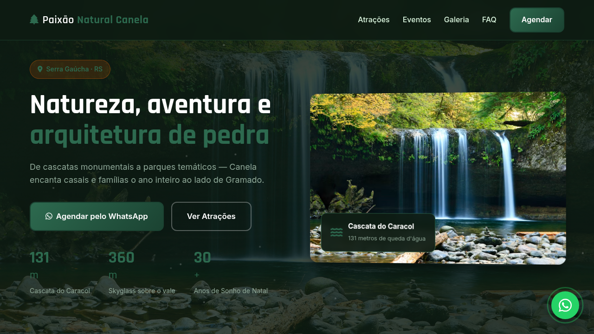
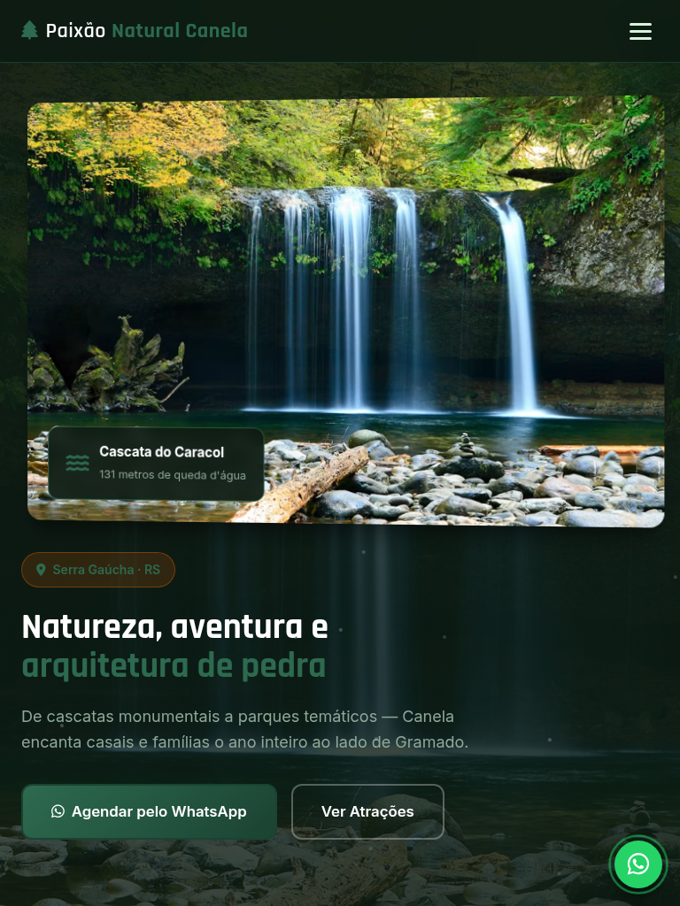
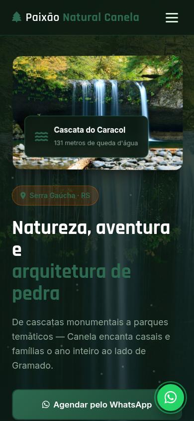

# Canela — Landing Page de Turismo

Landing page de alta conversão para turismo em **Canela** (Serra Gaúcha · RS), com atrações autênticas, eventos locais, galeria visual e agendamento estruturado via WhatsApp.

[](https://tofariasti.github.io/turismo-canela/)

## Demo

**Moldura (preview):** [https://tofariasti.github.io/turismo-canela/](https://tofariasti.github.io/turismo-canela/)

**Tela cheia:** [https://tofariasti.github.io/turismo-canela/site/](https://tofariasti.github.io/turismo-canela/site/)

## Screenshots

### Desktop (1280px)


### Tablet (768px)


### Mobile (390px)


## Funcionalidades

- Design responsivo mobile-first com identidade visual regional
- Integração WhatsApp com formulário para agendar visita (nome, data, pessoas, roteiro)
- Animações AOS, partículas no hero, contadores e hover nos cards
- Seções: Hero, Como funciona, Atrações, Eventos, Galeria, FAQ e Contato
- Botão flutuante WhatsApp com pulse
- Acessibilidade: skip link, ARIA, contraste, foco visível, alt text
- Respeita `prefers-reduced-motion`
- Moldura iframe com preview desktop/tablet/mobile

## Pontos turísticos destacados

- **Parque Estadual do Caracol** — Cartão-postal com cascata de 131 m, mirante, trilhas e bondinho aéreo.
- **Catedral de Pedra** — Igreja gótica com torre de 60 m — uma das Sete Maravilhas do Brasil. Show de luzes à noite.
- **Skyglass Canela** — Plataforma de vidro a 360 m de altura com vista do Vale da Ferradura.
- **Estação Campos de Canela** — Antiga estação ferroviária revitalizada com maria-fumaça, lojas e restaurantes.
- **Mundo a Vapor** — Museu temático com miniaturas industriais em funcionamento — tradição desde 1983.
- **Alpen Park** — Trenó de montanha, tirolesa e aventura com vista para a serra.

## Eventos

- **Sonho de Natal** (Out–Jan) — Maior evento natalino de Canela com decoração, shows e Vila de Natal.
- **Festa Colonial** (Jul) — Gastronomia, música e tradições da colonização europeia.
- **Semana Farroupilha** (Set) — Acampamentos, chimarrão e cultura gaúcha no município.
- **Roda Canela** (Ano todo) — Roda-gigante de 52 m ao lado do Mundo a Vapor.

## Tecnologias

- HTML5 semântico · CSS3 · JavaScript vanilla
- AOS 2.3.4 · Font Awesome 6.4 · Google Fonts (Rajdhani + Inter)

## Screenshots (geração)

```bash
python3 -m http.server 8765
npm install
npm run screenshots
```

## Repositório

https://github.com/tofariasti/turismo-canela

## Autor

**Tiago O. de Farias** — [Farias Digital](https://fariasdigital.com.br/)

---

<p align="center">
  <a href="https://tofariasti.github.io/turismo-canela/">🌐 Demo Online</a> ·
  <a href="https://fariasdigital.com.br/">🏢 Site Comercial</a>
</p>
